# Architecture Diagrams — AI Student Tutor Platform v2.1 (Revised)

> **Date:** 2026-06-19 | **Version:** 2.0 | **Format:** Mermaid (renders on GitHub)

---

## 1. System Architecture (v2.0 — Multi-Role)

```mermaid
graph TB
    subgraph Client["CLIENT LAYER — 4 Portals"]
        StudentP["Student Portal\n(Learning, Chat, Practice)"]
        TutorP["Tutor Portal\n(Review, Students, Feedback)"]
        PrincipalP["Principal Portal\n(Monitor, Quality, Reports)"]
        AdminP["Admin Portal\n(Governance, Users, Analytics)"]
    end

    subgraph Gateway["API GATEWAY"]
        Nginx["Nginx (TLS 1.3)"]
        FastAPI["FastAPI (Uvicorn Workers)"]
        WS["WebSocket Handler"]
        Auth["JWT Auth\n(4 Roles)"]
    end

    subgraph Services["SERVICE LAYER"]
        LearnSvc["Learning\nService"]
        AssessSvc["Assessment\nService"]
        ContentSvc["Content\nGenerator"]
        ReviewSvc["Content\nReview"]
        VerifySvc["Verification\nService"]
        MatchSvc["Matching\nService"]
        AnalyticsSvc["Analytics\nService"]
        VoiceSvc["Voice\nService"]
    end

    subgraph AI["AI AGENT LAYER — 12 Agents"]
        Orch["LangGraph\nOrchestrator"]
        Teacher["1. Teacher\nAgent"]
        AssessA["2. Assessment\nAgent"]
        CurricA["3. Curriculum\nAgent"]
        MotivA["4. Motivation\nAgent"]
        ContentA["5. Content Gen\nAgent"]
        PersonalA["6. Personalize\nAgent"]
        VideoA["7. Video Gen\nAgent"]
        VerifyA["8. Verification\nAgent"]
        VoiceA["9. Voice\nAgent"]
        MatchA["10. Matching\nAgent"]
        AnalyticsA["11. Analytics\nAgent"]
        ReportA["12. Report\nAgent"]
        Router["Model\nRouter"]
    end

    subgraph Models["MODEL LAYER"]
        GPT4o["GPT-4o"]
        GPT4oMini["GPT-4o-mini"]
        DeepSeek["DeepSeek V4"]
        Whisper["Whisper (STT)"]
        TTS["ElevenLabs/Azure (TTS)"]
        SymPy["SymPy (Math)"]
        OCR["Tesseract (OCR)"]
    end

    subgraph Data["DATA LAYER"]
        PG["PostgreSQL 16"]
        Redis["Redis 7"]
        Qdrant["Qdrant\n(Vector DB)"]
        MinIO["MinIO / S3\n(Files)"]
        RabbitMQ["RabbitMQ\n(Async Tasks)"]
    end

    subgraph Observe["OBSERVABILITY"]
        Langfuse["Langfuse\n(LLM Trace)"]
        Prometheus["Prometheus"]
        Grafana["Grafana"]
    end

    StudentP & TutorP & PrincipalP & AdminP --> Nginx
    Nginx --> Auth
    Auth --> FastAPI
    FastAPI --> WS
    FastAPI --> Services
    Services --> AI
    Orch --> Teacher & AssessA & CurricA & MotivA & ContentA & PersonalA & VideoA & VerifyA
    Orch --> VoiceA & MatchA & AnalyticsA & ReportA
    AI --> Router
    Router --> GPT4o & GPT4oMini & DeepSeek
    VoiceSvc --> Whisper & TTS
    AssessA --> SymPy & OCR
    ContentA --> GPT4o
    Services --> PG & Redis
    CurricA & ContentA --> Qdrant
    ContentSvc --> MinIO
    ContentSvc --> RabbitMQ
    AI --> Langfuse
    FastAPI --> Prometheus --> Grafana
```

---

## 2. Content Generation Pipeline

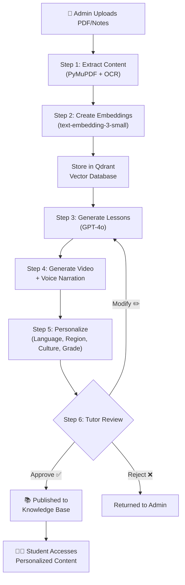

---

## 3. Tutor Approval Workflow

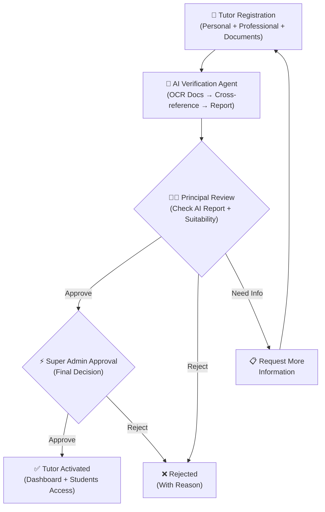

---

## 4. Student Learning Journey (8 Steps)

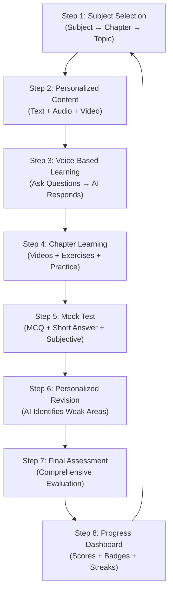

---

## 5. Assessment Engine Architecture

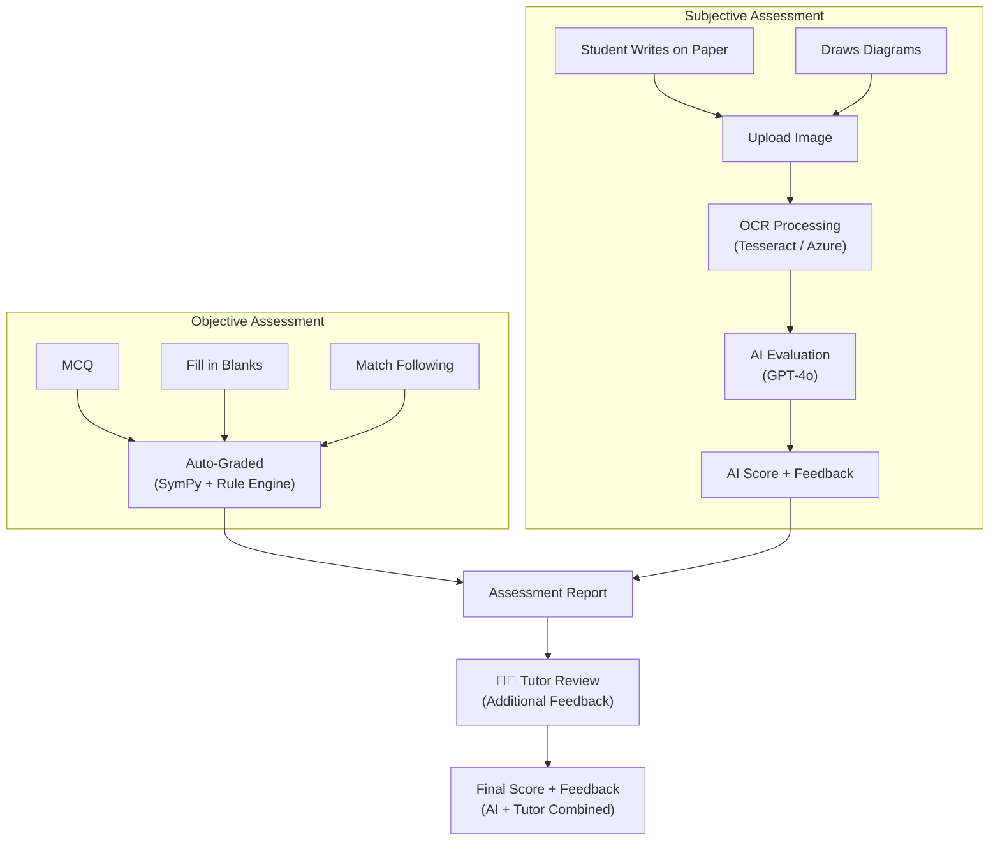

---

## 6. Multi-Agent Orchestration Flow

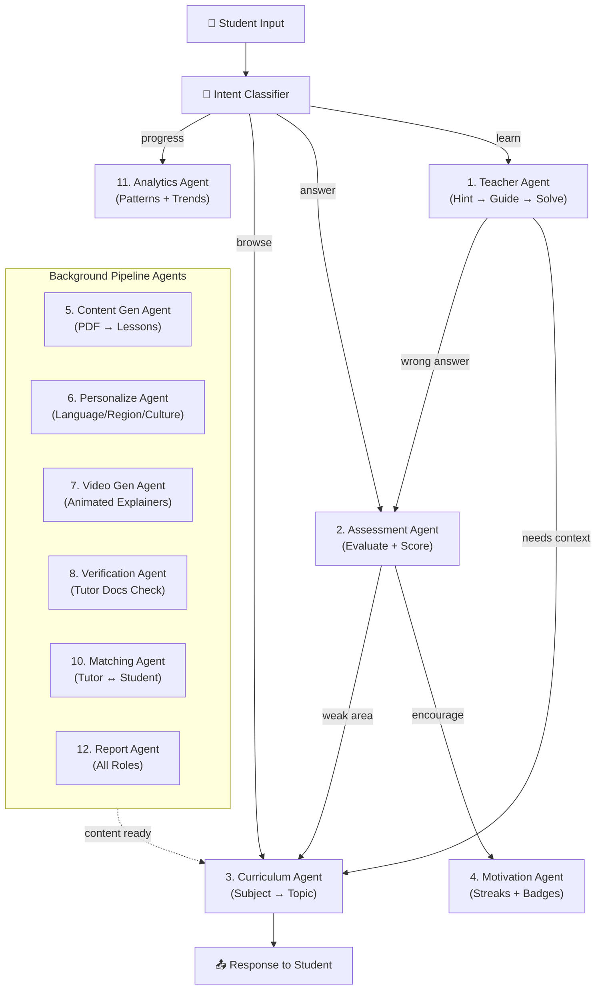

---

## 7. Database Entity Relationship (v2.0)

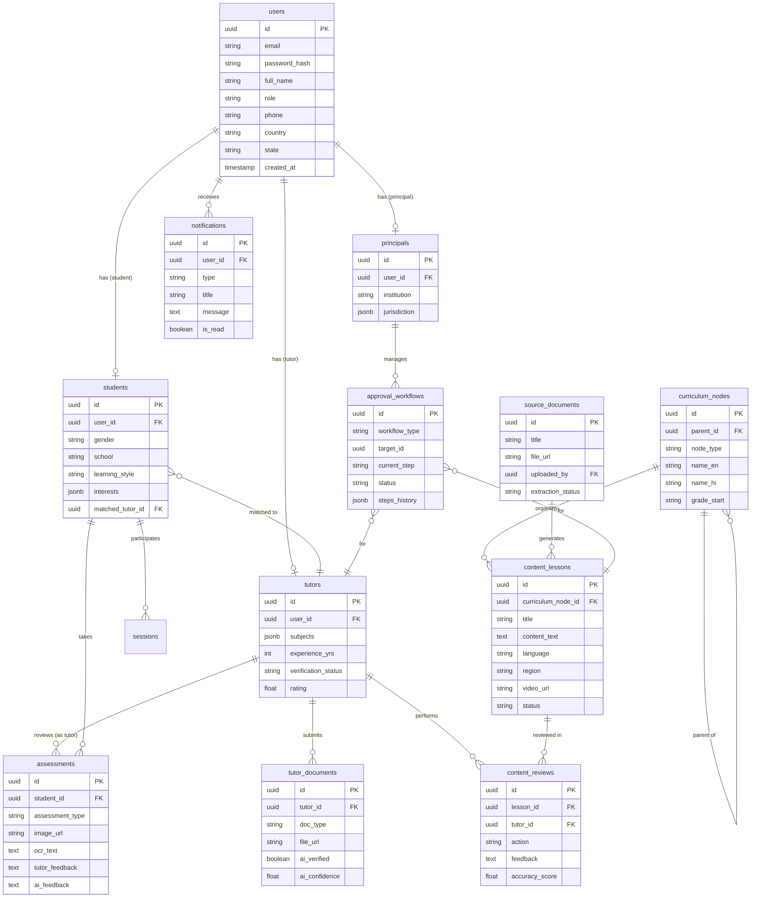

---

## 8. Deployment Architecture

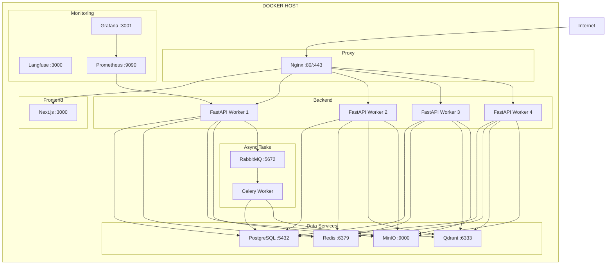

---

## 9. Hint → Guide → Solve Flow (Student Interaction)

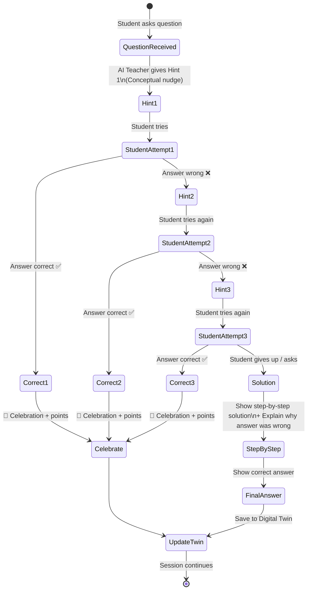

---

*Diagrams render natively on GitHub when viewing the markdown file.*

---

## 10. Notification & Feedback Flow (v2.1)

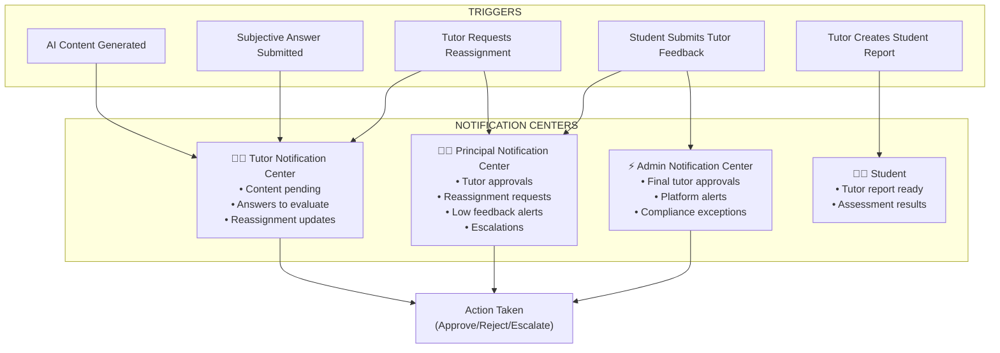

## 11. Student Feedback → Principal Oversight Flow (v2.1)

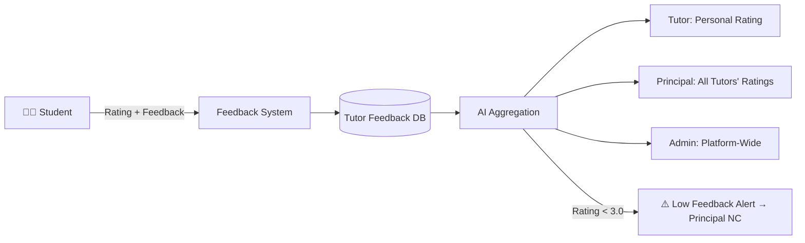
