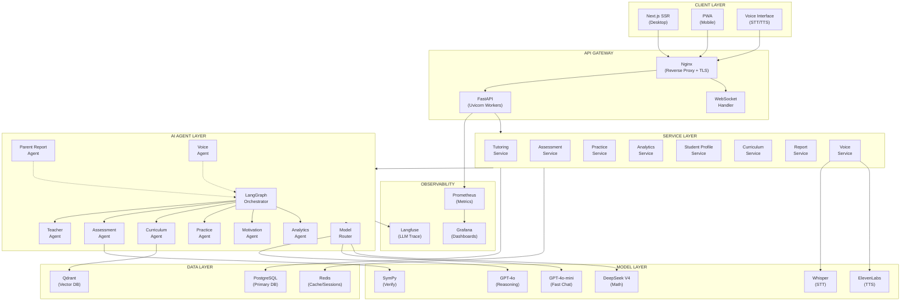
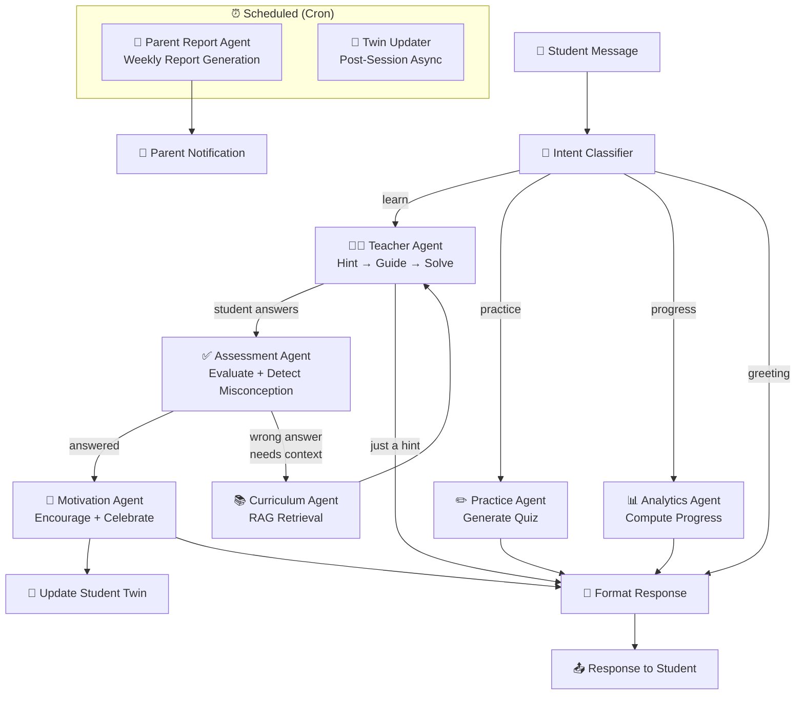
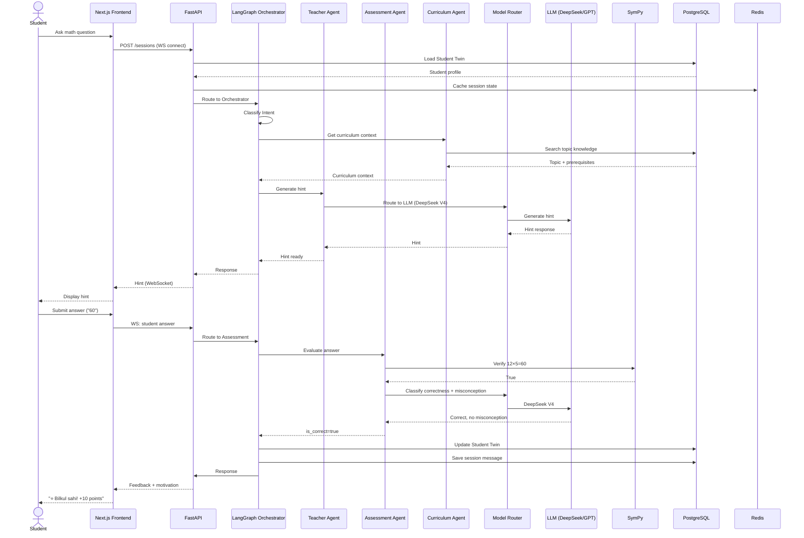
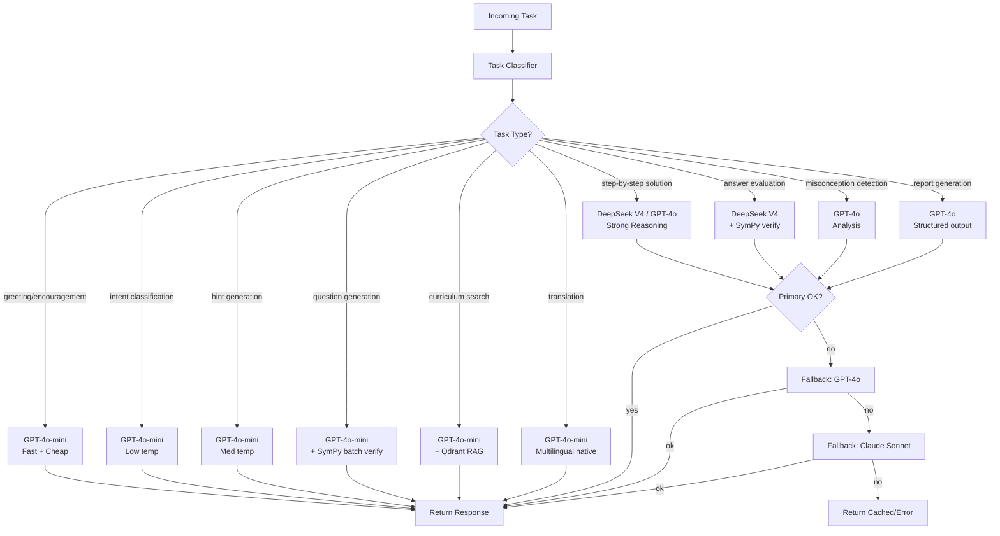
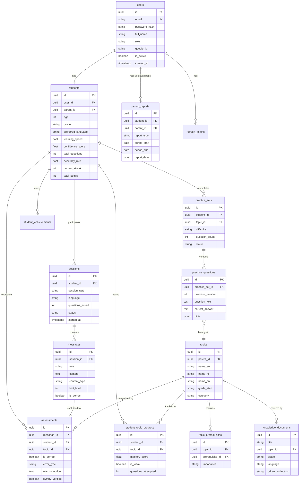
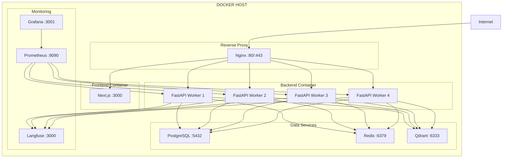
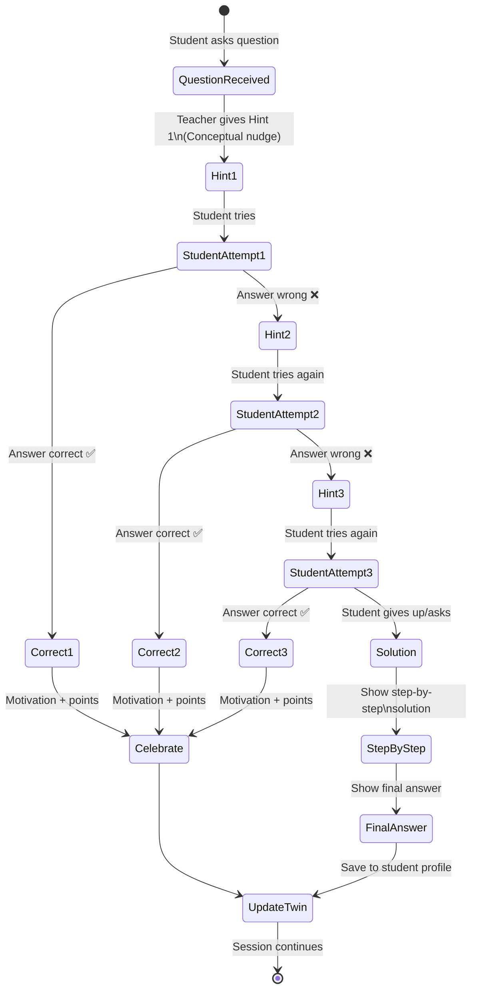

# Architecture Diagrams

> **Date:** 2026-06-19
> **Format:** Mermaid (renders on GitHub)

---

## 1. System Architecture

---

## 2. Multi-Agent Workflow

---

## 3. Data Flow: Tutoring Session

---

## 4. Model Routing Decision Tree

---

## 5. Database ER Diagram

---

## 6. Deployment Architecture

---

## 7. Hint → Guide → Solve Flow

---

*These diagrams are rendered natively by GitHub when viewing the markdown files.*
